# BBEdit and TextWrangler Fabric Engine KL Codeless Language Module  #
**Version 1.1** Released June 23, 2014  
by Andrew Hazelden  

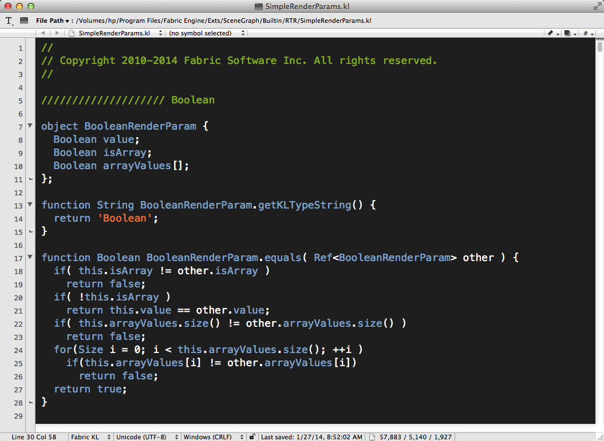

## Overview ##
I would like to present a new BBEdit and TextWrangler syntax highlighting module that works with code from [Fabric Engine's KL language](http://documentation.fabric-engine.com/FabricEngine/1.11.0/HTML/KLProgrammingGuide/index.html). The new module makes it easier for a VFX Artist or Technical Director to edit a KL script.

**Note:** This syntax highlighting module requires either [TextWrangler (free)](http://www.barebones.com/products/textwrangler/) or [BBEdit](http://www.barebones.com/products/bbedit/) from Bare Bones Software.

## Download ##

The Fabric Engine KL Syntax Highlighter module is a free download.

You can download the latest version here:   
[http://www.andrewhazelden.com/blog/2014/03/fabric-engine-kl-syntax-highlighter/](http://www.andrewhazelden.com/blog/2014/03/fabric-engine-kl-syntax-highlighter)

## Installation ##

**Step 1.**  [Download TextWrangler](http://www.barebones.com/products/textwrangler/) and install it on your system. If you own a copy of [BBEdit](http://www.barebones.com/products/bbedit/) you can use it instead. After you install the software, run it once to create the preference folders.

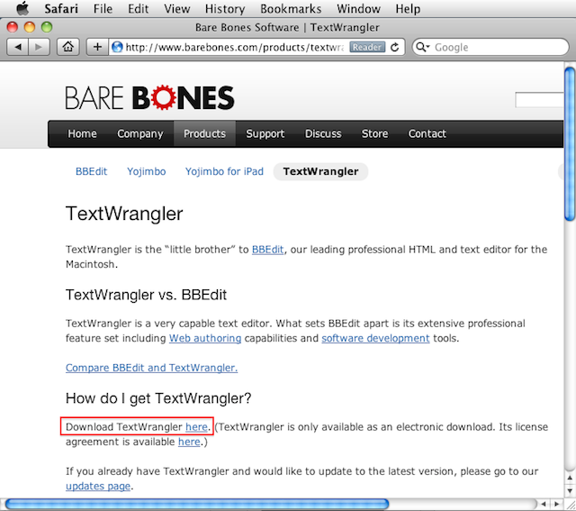

**Step 2.**  Copy the "Fabric Engine KL.plist" file from the **install** folder to your Language Modules folder.

If you are using TextWrangler the module belongs in this folder:  
    ~/Library/Application Support/TextWrangler/Language Modules/

If you are using BBEdit the module belongs in this folder:  
    ~/Library/Application Support/BBEdit/Language Modules/

On Mac OS X Lion / Mountain Lion you can open the hidden **~/Library** folder by switching to the Finder. From the "Go" Menu select, "Go to Folder..." or press the hotkey **Shift-Command-G**.

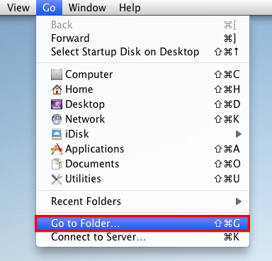

Paste in the Languages Module folder path and hit "go". 

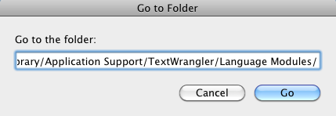

If you are running Mountain Lion and the BBEdit / TextWrangler "Language Modules" folder doesn't exist you can create the folders manually. A quick way to create the folders is to use the terminal:

TextWrangler Folder Creation Command:  
> mkdir -p ~/"Library/Application Support/TextWrangler/Language Modules/"

BBEdit Folder Creation Command:  
> mkdir -p ~/"Library/Application Support/BBEdit/Language Modules/"

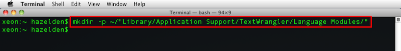

Once you are in the Language Modules folder you can copy the **Fabric Engine KL.plist** file in place.

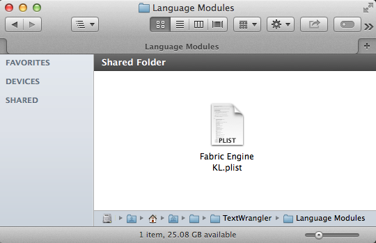

**Step 3.**  We need to restart TextWrangler for the new language module to be listed in the TextWrangler language popup menu.

If you open a Fabric Engine .kl script at this point you will see formatted text. If you are working on an Fabric Engine file without the .kl extension you can select the language manually.

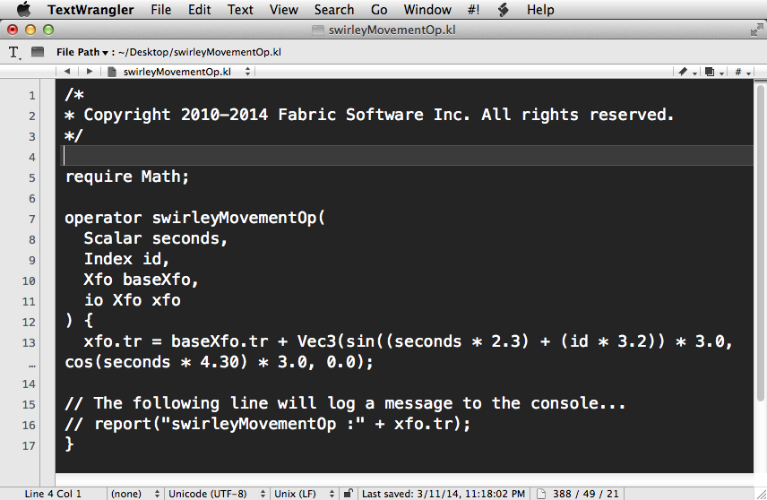

Open the **Language** popup menu at the bottom left of the text editor window and select **Fabric KL**. This will turn on syntax highlighting.

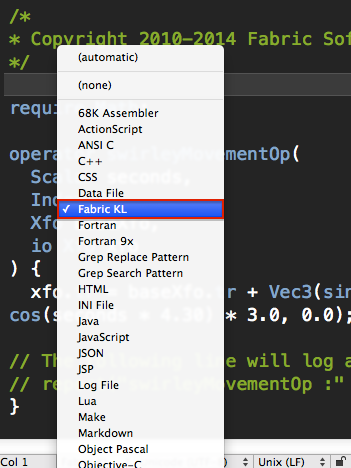

Here is an example Fabric Engine .kl script with syntax highlighting enabled:

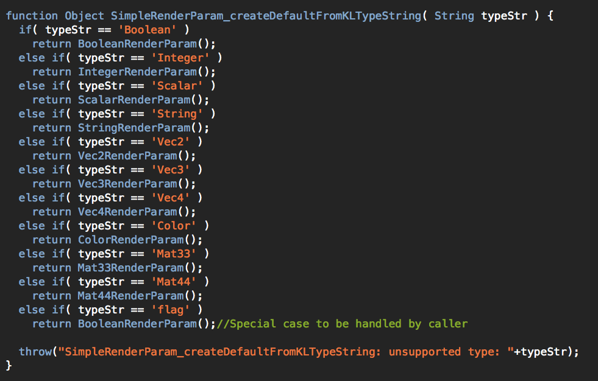

## Bonus - Download a Color Scheme ##

If you are new to TextWrangler or BBEdit you will probably want to download a color scheme to customize your work environment. I've written two themes to get you started: The [Charcoal Color Scheme](http://www.andrewhazelden.com/blog/2012/09/charcoal-color-scheme-for-textwrangler-and-bbedit/) and the [Midnight Blue Color Scheme](http://www.andrewhazelden.com/blog/2012/06/midnight-blue-color-scheme-for-textwrangler-and-bbedit/).

This is the view with the default color scheme that comes with TextWrangler / BBEdit:  

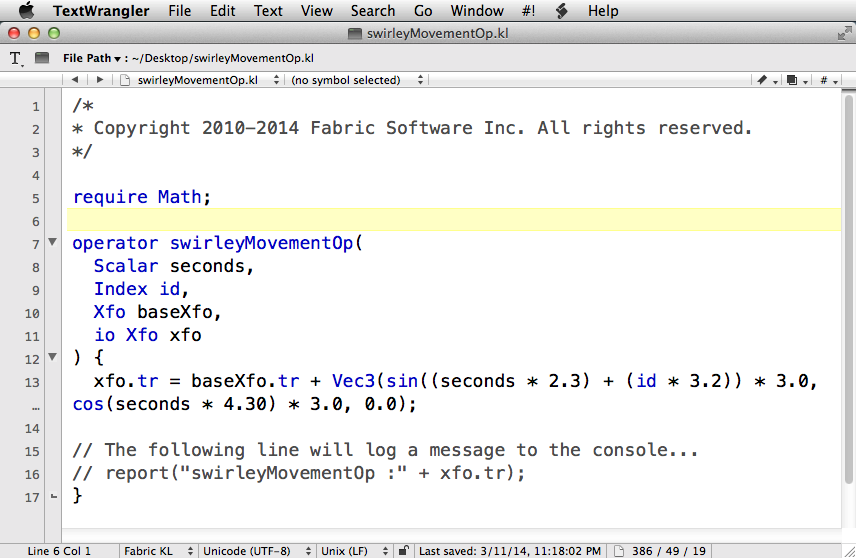

* * *

This is the view with the [Charcoal Color Scheme](http://www.andrewhazelden.com/blog/2012/09/charcoal-color-scheme-for-textwrangler-and-bbedit/) in action:  

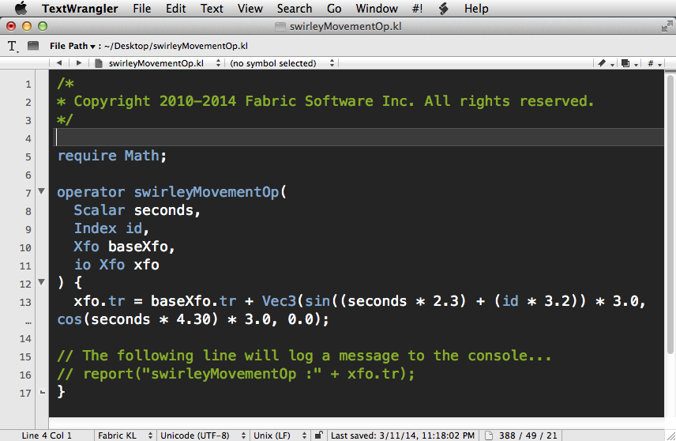

* * *

This is the view with the  [Midnight Blue Color Scheme](http://www.andrewhazelden.com/blog/2012/06/midnight-blue-color-scheme-for-textwrangler-and-bbedit/) in action:  

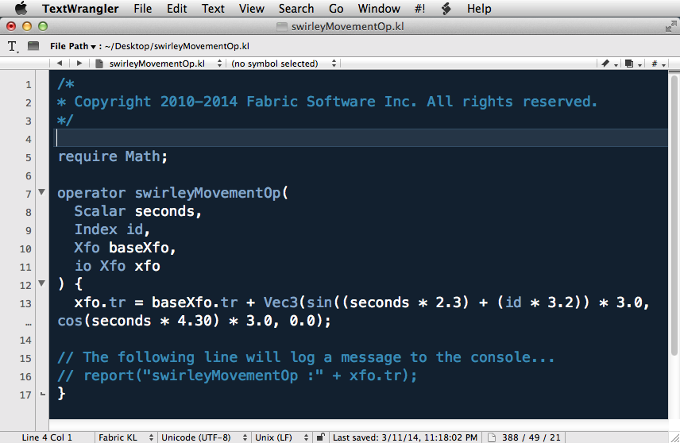

* * *

I hope this tool improves your coding workflow as you develop new .kl files using TextWrangler or BBEdit on a Mac OS X System.

Cheers,  
Andrew Hazelden

eMail: [andrew@andrewhazelden.com](mailto:andrew@andrewhazelden.com)   
Blog: [http://www.andrewhazelden.com](http://www.andrewhazelden.com)  
Twitter: [@andrewhazelden](https://twitter.com/andrewhazelden)  
Google+: [https://plus.google.com/u/0/105694670378845894137](https://plus.google.com/u/0/105694670378845894137)

