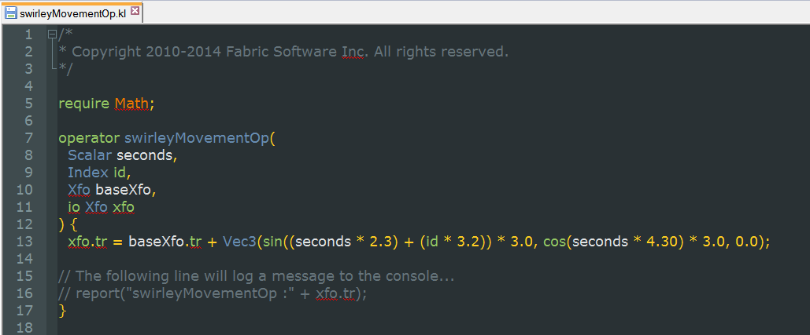

# Fabric Engine KL Syntax Highlighters #
**Version 0.1** Released March 12, 2013   
by Andrew Hazelden

## Overview ##

This is a repository for syntax highlighting modules for [Fabric Engine's KL language](http://documentation.fabric-engine.com/FabricEngine/1.11.0/HTML/KLProgrammingGuide/index.html). This syntax highlighter collection will be updated as more text editors are supported.

----------

Cheers,  
Andrew Hazelden

Email: [andrew@andrewhazelden.com](mailto:andrew@andrewhazelden.com)   
Blog: [http://www.andrewhazelden.com](http://www.andrewhazelden.com)  
Twitter: [@andrewhazelden](https://twitter.com/andrewhazelden)  
Google+: [https://plus.google.com/+AndrewHazelden](https://plus.google.com/+AndrewHazelden)
